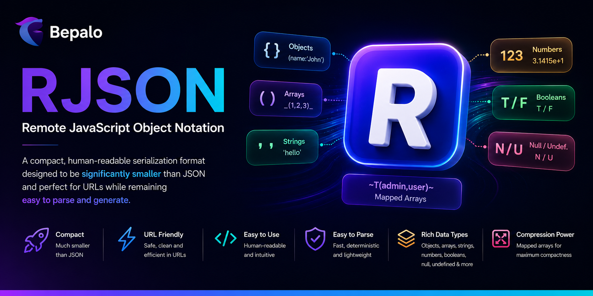

# 🏆 @bepalo/rjson



[](https://www.npmjs.com/package/@bepalo/rjson)
[](https://github.com/bepalo/rjson/actions/workflows/ci.yaml)
[](https://github.com/bepalo/rjson/actions/workflows/testing.yaml)
[](LICENSE)

<!--  -->

[](test-result.md)

**A compact, URL-friendly serialization format that is smaller than JSON while remaining human-readable and fast to parse.**

RJSON (Remote JavaScript Object Notation) is a specification and implementation inspired by RISON and it was originally designed for better frontend-to-backend communication via search parameters.

## 🎯 Why RJSON?

JSON is an excellent interchange format, but:

- It is not as compressed as it can be
- It is not url friendly
- It cannot represent several JavaScript runtime values: `undefined` `NaN` `Infinity` `-Infinity` `-0`

RJSON preserves these values while remaining compact, human-readable, and URL-friendly.

```ts
const value = {
  active: true,
  deletedAt: undefined,
  score: NaN,
  "limit.upper": Infinity,
  "limit.lower": -Infinity,
};

const text = RJSON.stringify(value);
```

Output:

```txt
(active:T,deletedAt:U,score:X,limit.upper:I,limit.lower:-I)
```

## ✨ Features

- ⚡ Fast parser with direct character scanning (recursive descent parsing).
- 📦 Smaller than JSON for many real-world payloads
- 🌐 URL-friendly syntax
- 🧩 Supports objects, arrays, strings, numbers, booleans
- 🔐 Supports `null`, `undefined`, `-0`, `NaN`, `Infinity`, `-Infinity`
- 🗜️ Built-in mapped-array compression `~T(id,title,body)~` -> `{ id:true, title:true, body:true }`
- 🔄 Value-preserving roundtrip. `RJSON.parse(RJSON.stringify(value))` preserves JavaScript value semantics.
- 📝 Tagged template support
- ☑️ Whitespace support (starting from v2.1.11)
- 🚀 Runtime agnostic (Node.js, Bun, Deno, Browser)
- 🟦 TypeScript ready
- 🔧 Zero dependencies

## 📑 Table of Contents

- [🎯 Why RJSON?](#-why-rjson)
- [✨ Features](#-features)
- [🚀 Get Started](#-get-started)
  - [📥 Installation](#-installation)
- [📦 Quick Start](#-quick-start)
  - [Parse RJSON](#parse-rjson)
  - [Stringify Objects](#stringify-objects)
  - [Stringify arrays](#stringify-arrays)
  - [Stringify mapped-arrays](#stringify-mapped-arrays)
  - [Tagged Template Helper](#tagged-template-helper)
- [📚 Syntax Overview](#-syntax-overview)
- [📚 Core Types](#-core-types)
  - [Objects](#objects)
  - [Arrays](#arrays)
  - [Nested Structures](#nested-structures)
  - [Strings](#strings)
  - [Numbers](#numbers)
  - [Booleans](#booleans)
  - [Null](#null)
  - [Undefined](#undefined)
- [🗜️ Mapped Arrays](#️-mapped-arrays)
- [🔧 API Reference](#-api-reference)
  - [parseRJSON](#parserjson)
  - [stringifyRJSON](#stringifyrjson)
  - [stringifyRJSONMappedArray](#stringifyrjsonmappedarray)
  - [rjson](#rjson)
- [📄 License](#-license)
- [🕊️ Thanks and Enjoy](#️-thanks-and-enjoy)
- [💖 Be a Sponsor](#-be-a-sponsor)

## 🚀 Get Started

### 📥 Installation

#### bun

```bash
bun add @bepalo/rjson
```

#### npm

```bash
npm install @bepalo/rjson
```

#### pnpm

```bash
pnpm add @bepalo/rjson
```

#### deno

```ts
import { RJSON } from "jsr:@bepalo/rjson";
```

## 📦 Quick Start

### Parse RJSON

```ts
import { RJSON } from "@bepalo/rjson";

const user = RJSON.parse(
  "(name:'Natnael',age:28,active:T,tasks:_('push','deploy','sleep')_)",
);

console.log(user);
```

Output:

```js
{
  name: "Natnael",
  age: 28,
  active: true,
  tasks: [ "push", "deploy", "sleep" ],
}
```

### Stringify Objects

```ts
import { RJSON } from "@bepalo/rjson";

const text = RJSON.stringify({
  name: "Natnael",
  age: 28,
  active: true,
});

console.log(text);
```

Output:

```txt
(name:'Natnael',age:28,active:T)
```

### Stringify arrays

```ts
import { RJSON } from "@bepalo/rjson";

const text = RJSON.stringify([1, 3.1415, null, undefined, true, "hello"]);

console.log(text);
```

Output:

```txt
_(1,3.1415,N,,T,'hello')_
```

### Stringify mapped-arrays

```ts
import { RJSON } from "@bepalo/rjson";

const text = RJSON.stringifyMappedArray(true, ["id", "title", "body"]);

console.log(text);
```

Output:

```txt
~T(id,title,body)~
```

### Tagged Template Helper

```ts
import { rjson } from "@bepalo/rjson";

const name = "Natnael";
const age = 28;

const user = rjson`(name:'${name}',age:${age},active:T)`;

console.log(user);
```

Output:

```js
{
  name: "Natnael",
  age: 28,
  active: true,
}
```

## 📚 Syntax Overview

| Type         | RJSON                         | JSON                         |
| ------------ | ----------------------------- | ---------------------------- |
| Object       | `(name:'John')`               | `{"name":"John"}`            |
| Array        | `_(1,2,3)_`                   | `[1,2,3]`                    |
| Mapped Array | `~T(admin,user)~`             | `{"admin":true,"user":true}` |
| String       | `'hello'` `"hello"` \`hello\` | `"hello"`                    |
| Number       | `123`                         | `123`                        |
| Boolean      | `T` / `F`                     | `true` / `false`             |
| Null         | `N`                           | `null`                       |
| Undefined    | `U`                           | Not supported                |
| NaN          | `X`                           | Not Supported                |
| Infinity     | `I`                           | Not Supported                |
| -Infinity    | `-I`                          | Not Supported                |
| -0           | `-0`                          | Not Supported                |

### 📚 Core Types

#### Objects

```txt
(name:'John',age:30)
```

Produces:

```js
{
  name: "John",
  age: 30
}
```

#### Arrays

```txt
_(1,2,3,4)_
```

Produces:

```js
[1, 2, 3, 4];
```

#### Nested Structures

```txt
(user:(name:'John',age:30),active:T)
```

Produces:

```js
{
  user: {
    name: "John",
    age: 30
  },
  active: true
}
```

#### Strings

RJSON supports three string delimiters: `'` `"` `

```txt
'hello'
"hello"
`hello`
```

The serializer automatically chooses the delimiter that requires the least escaping.

```ts
RJSON.stringify(`'"hello"'`);
```

Output:

```txt
`'"hello"'`
```

This keeps serialized output compact and readable.

#### Numbers

Supported formats:

```txt
123
-123
+123
12.5
1e10
1e-10
-0
X -> NaN
I -> Infinity
-I -> -Infinity
```

Examples:

```txt
age:28
price:19.99
distance:1.5e6
```

#### Booleans

```txt
_( T, F )_
```

Produces:

```js
[true, false];
```

#### Null

```txt
N
```

Produces:

```js
null;
```

#### Undefined

```txt
(name:U)
```

Produces:

```js
{
  name: undefined;
}
```

Empty values are also treated as undefined:

```txt
(name:,array:_(,)_,mapped:~(a)~,empty:(),end:)
```

Produces:

```js
{
  name: undefined,
  array: [ undefined ],
  mapped: {
    a: undefined,
  },
  empty: {},
  end: undefined,
}
```

### 🗜️ Mapped Arrays

Mapped arrays compress repeated values.

Instead of doing:

```js
{
  admin: true,
  editor: true,
  user: true
}
```

Use:

```txt
~T(admin,editor,user)~
```

Produces:

```js
{
  admin: true,
  editor: true,
  user: true
}
```

---

The value can be any valid RJSON type. However, to have an object as value
its start token `(` has to be escaped.

_NOTE: Allowed whitespace positions. Also whitespaces are not required._

```txt
~ \(roles:_('admin','user')_) (create,update,delete)~

~ F (create,update,delete)~

~ ~ F (admin,user)~ (create,update,delete)~
```

## 🔧 API Reference

### parseRJSON

Parses RJSON from string.

```ts
const value = parseRJSON("(name:'John',active:T)");
```

### stringifyRJSON

Serializes JavaScript values to RJSON format.

```ts
const text = stringifyRJSON({
  name: "John",
  active: true,
});
```

Result:

```txt
(name:'John',active:T)
```

### stringifyRJSONMappedArray

Creates mapped-array expressions.

```ts
stringifyRJSONMappedArray(true, ["read", "write", "delete"]);
```

Result:

```txt
~T(read,write,delete)~
```

### rjson

Tagged-template parser.

```ts
const data = rjson`
(name:'John')
`;
```

## 🔄 Migration Guide

### Upgrading from v1.0.10 to v2.1.11

RJSON `v2.x` introduces a fully optimized grammar layout that treats explicit `null` and implicit `undefined` as independent, native values. If you are migrating an existing application from a `v1.x` runtime, use the matrix below to audit changes to your network transport footprints and api surface.

#### Serialization Footprint Matrix

| Value / API Reference       | Target v1.0.10          | Target v2.1.11        | Notes / Semantic Shifts                                                            |
| :-------------------------- | :---------------------- | :-------------------- | :--------------------------------------------------------------------------------- |
| **`null`**                  | `""`                    | `"N"`                 | Now serialized explicitly to prevent collision with missing properties.            |
| **`undefined`**             | `"U"`                   | `""` \| `"U"`         | Evaluates to an empty slot inside collection layouts; returns `"U"` if standalone. |
| **`[1, undefined, 3]`**     | `_(1,U,3)_`             | `_(1,,3)_`            | Array holes leverage highly efficient conditional trailing comma notation.         |
| **`[,]`** **`[,,]`**        | `_()_` `_(,)_`          | `_(,)_` `_(,,)_`      | Empty array elements are now handled properly and treated as `undefined`.          |
| **`NaN`**                   | `null`                  | `X`                   | Native support added for IEEE 754 special values.                                  |
| **`Infinity`**              | `null`                  | `I`                   | Native positive infinity tracking.                                                 |
| **`-Infinity`**             | `null`                  | `-I`                  | Native negative infinity tracking.                                                 |
| **`-0`**                    | `0`                     | `-0`                  | Sign-bit fidelity preserved during serialization loops.                            |
| **`stringifyRJSONString`**  | `stringifyRJSONString`  | `stringifyRJSONText`  | Utility renamed to clear naming collision with global `String`.                    |
| **`RJSON.stringifyString`** | `RJSON.stringifyString` | `RJSON.stringifyText` | Namespace reference updated to point to the text subsystem encoder.                |

## 📄 License

MIT

## 🕊️ Thanks and Enjoy

If you find RJSON useful, please consider starring the repository and sharing it with others.

## 💖 Be a Sponsor

Support development and future improvements.

<a href="https://ko-fi.com/natieshzed">
  
</a>
